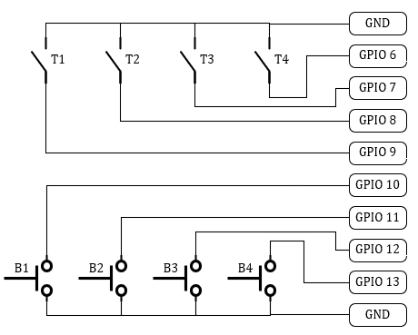

# Gordons Sim Controller

A **config-driven Arduino / RP2040 HID input system** for building physical control panels—buttons, 2-way toggles, 3-way toggles, and more—that send **keyboard input** to a PC.

Designed for **Raspberry Pi Pico**, but compatible with any Arduino board that supports **USB HID**.

---

## Features

- Direct support for **buttons**, **2-way toggles**, and **3-way toggles**
- Keyboard output with **modifier combinations** (Shift, Ctrl, Alt, etc.)
- **Predicate system** for modes, layers, and conditional logic
- Entire behavior defined in **one config file**
- Clean separation between **logic** and **configuration**
- Easily extensible for complex control panels

> All user configuration lives in `inputs_config.h`  
> **You do not need to edit the `.ino` file.**

---

## Core Concepts

The system is built around three concepts:

### 1. Predicates

Boolean flags that represent modes, layers, or states.

Predicates are optional, but unlock advanced behavior.

---

### 2. Virtual Keys

Logical keyboard actions that may:
- Send a key
- Include modifier keys
- Be gated by one or more predicates

Think of these as **“what happens”**.

---

### 3. Physical Inputs

GPIO-connected hardware inputs such as:
- Buttons
- Toggles

Each physical input is mapped to one or more Virtual Keys.

Think of these as **“what you press”**.

---

## Setup

Open the project using **Arduino IDE**.

### Raspberry Pi Pico

1. Install the board package:  
   **Raspberry Pi Pico / RP2040 / RP2350** by *Earle F. Philhower*
2. Install the **Keyboard** library
3. Set:
   - **Board:** Raspberry Pi Pico
   - **USB Stack:** Pico SDK

---

## Configuration

The project contains 3 files:
- `GordonsSimController.ino` : Main program and logic. Do not edit this.
- `inputs_definitions.h` : Defines input objects. Do not edit this.
- `inputs_config.h` : The config you want to edit.

All configuration is done in `inputs_config.h`.

You will define your configuration in **three arrays**:
- `Predicate predicates[]`
- `VirtualKey virtualKeys[]`
- `PhysicalInput physicalInputs[]`

You will enter your configuration into the arrays like this:
```c
VirtualKey virtualKeys[] = {
    VIRTUAL_KEY("power_on", 'p'),
    VIRTUAL_KEY_MOD("power_off", 'p', MOD_ALT)
}
```
---

## Predicates

Predicates are **named boolean flags** used to enable or disable Virtual Keys.

They allow you to build:
- Modes
- Layers
- Conditional logic

### Defining a Predicate

```c
PRED("gear"),
```
> Once defined, a predicate can be referenced by Virtual Keys to control when they are active.

---

## Virtual Keys

Virtual Keys defines the keypress that will be emulated when it's activated.

### Defining a Virtual Key

```c
VIRTUAL_KEY("myKey", 'a')
```
> This send the keypress `a` when the virtual key `myKey` is activated.

#### Virtual Key with modifiers
```c
VIRTUAL_KEY_MOD("key_i_ctrl", 'i', MOD_CTRL)
```
> This send the keypress `LEFT_CTRL + i` when the virtual key `key_i_ctrl` is activated.

Available modifier groups:
- `MOD_NONE`
- `MOD_CTRL`
- `MOD_SHIFT`
- `MOD_ALT`
- `MOD_CTRL_SHIFT`
- `MOD_CTRL_ALT`
- `MOD_SHIFT_ALT`
- `MOD_CTRL_SHIFT_ALT`

#### Predicate-gated Virtual Key
```c
VIRTUAL_KEY_PRED("key_b", 'b', "mode")
```
> This only sends the keypress if the `mode` predicate is true.

#### Full virtual key (modifiers + predicate)
```c
VIRTUAL_KEY_FULL("key_x", 'x', MOD_SHIFT, "mode")
```

#### Special Keys
It is possible to pass special keys and function keys.
- `KEY_F1`
- `KEY_F2`
- `KEY_F3`
- `KEY_F4`
- `KEY_F5`
- `KEY_F6`
- `KEY_F7`
- `KEY_F8`
- `KEY_F9`
- `KEY_F10`
- `KEY_F11`
- `KEY_F12`
- `KEY_RETURN`
- `KEY_ESC`
- `KEY_BACKSPACE`
- `KEY_TAB`
- `KEY_SPACE`
- `KEY_LEFT_CTRL`
- `KEY_LEFT_SHIFT`
- `KEY_LEFT_ALT`
- `KEY_LEFT_GUI`
- `KEY_RIGHT_CTRL`
- `KEY_RIGHT_SHIFT`
- `KEY_RIGHT_ALT`
- `KEY_RIGHT_GUI`
- `KEY_UP_ARROW`
- `KEY_DOWN_ARROW`
- `KEY_LEFT_ARROW`
- `KEY_RIGHT_ARROW`

Example:
```c
VIRTUAL_KEY("Jump", KEY_SPACE)
```

---

## Physical Inputs
A Physical Input defines a type of physical switch and what pin it is connected to.

There a 3 types of physical inputs:
- `BUTTON` - A momentary switch that holds the keypress until released.
- `TOGGLE_2WAY` - An ON-OFF (or ON-ON with 1 unused pin) toggle.
- `TOGGLE_3WAY` - An ON-OFF-ON toggle.

Toggles can either send a key or change a predicate.

All inputs use `INPUT_PULLUP`.

Switches should connect **GPIO** and **GND**.

### Defining a Physical Input

#### BUTTON
```c
BUTTON("fire", 18, "myKey")
```
> When pin 18 goes `HIGH`, activate Virtual Key `myKey`.
>
> The key will be held down until the switch is released.

#### TOGGLE_2WAY
```c
TOGGLE_2WAY_KEY("gear", 19, "key_0", "key_9")
```
> When pin 19 goes `HIGH`, activate `key_0`.
> 
> When pin 19 goes `LOW`, activate `key_9`.
> 
> Each key is only tapped once and will not be held down.

#### TOGGLE_3WAY
```c
TOGGLE_3WAY_KEY("modeSelect", 16, 17, "key_1", "key_2", "key_3")
```
> When pin 16 goes `HIGH`, activate `key_1`.
> 
> When pin 17 goes `HIGH`, activate `key_3`.
> 
> When either pin goes `LOW`, activate `key_2`.
> 
> Each key is only tapped once and will not be held down.

### Defining a Predicate Toggle
```c
TOGGLE_2WAY_PRED("modeSwitch", 26, "modeA", "modeB")
```
> When pin 26 goes `HIGH`, set predicates `modeA` to true and `modeB` to false.
> 
> When pin 26 goes `LOW`, set predicates `modeB` to true and `modeA` to false.

```c
TOGGLE_3WAY_PRED("selector", 7, 8, "modeA", "modeB", "modeC")
```
> When pin 7 goes `HIGH`, set predicates `modeA` to true, set `modeB` and `modeC` to false.
> 
> When pin 8 goes `HIGH`, set predicates `modeC` to true, set `modeB` and `modeA` to false.
> 
> When either pin goes `LOW`, set predicates `modeC` to true, set `modeA` and `modeB` to false.

---

## Examples
We will use a button box with 4 toggle switches and 4 momentary button switches as an example.



### Basic Example
In this example we want the toggles and buttons to do the following:
- `Toggle 1 - Power`
- `Toggle 2 - Landing Gear`
- `Toggle 3 - Nav Lights`
- `Toggle 4 - Headlights`
- `Button 1 - Boost`
- `Button 2 - Autoland`
- `Button 3 - Camera`
- `Button 4 - Eject`

#### Predicates
No predicates used in this example.

#### Virtual Keys
```c
VIRTUAL_KEY("power_on", 'p'),
VIRTUAL_KEY_MOD("power_off", 'p', MOD_ALT),
VIRTUAL_KEY("gear_down", '0'),
VIRTUAL_KEY("gear_up", '9'),
VIRTUAL_KEY("nav_lights_on", 'n'),
VIRTUAL_KEY_MOD("nav_lights_off", 'n', MOD_ALT),
VIRTUAL_KEY("headlights_on", 'h'),
VIRTUAL_KEY_MOD("headlights_off", 'h', MOD_ALT),
VIRTUAL_KEY("boost", 'b'),
VIRTUAL_KEY("autoland", 'l'),
VIRTUAL_KEY("camera", KEY_F4),
VIRTUAL_KEY("eject", KEY_BACKSPACE)
```

#### Physical Inputs
```c
TOGGLE_2WAY_KEY("power", 9, "power_on", "power_off"),
TOGGLE_2WAY_KEY("gear", 8, "gear_up", "gear_down"),
TOGGLE_2WAY_KEY("nav_lights", 7, "nav_lights_on", "nav_lights_off"),
TOGGLE_2WAY_KEY("headlights", 6, "headlights_on", "headlights_off"),
BUTTON("boost", 10, "boost"),
BUTTON("autoland", 11, "autoland"),
BUTTON("camera", 12, "camera"),
BUTTON("eject", 13, "eject")
```

### Example With Predicates
In this example we want to have a toggle switch between Combat Mode and Normal Mode, when in Combat Mode the buttons selects a weapon instead.
We will have the following buttons and toggles:
- `Toggle 1 - Power`
- `Toggle 2 - Landing Gear`
- `Toggle 3 - Nav Lights`
- `Toggle 4 - Normal/Combat Mode Selector`
- `Button 1 - Boost | Weapon 1`
- `Button 2 - Autoland | Weapon 2`
- `Button 3 - Camera | Weapon 3`
- `Button 4 - Eject | Weapon 4`

#### Predicates
```c
PRED("normal"),
PRED("combat")
```

#### Virtual Keys
```c
VIRTUAL_KEY("power_on", 'p'),
VIRTUAL_KEY_MOD("power_off", 'p', MOD_ALT),
VIRTUAL_KEY("gear_down", '0'),
VIRTUAL_KEY("gear_up", '9'),
VIRTUAL_KEY("nav_lights_on", 'n'),
VIRTUAL_KEY_MOD("nav_lights_off", 'n', MOD_ALT),
VIRTUAL_KEY_PRED("boost", 'b', "normal"),
VIRTUAL_KEY_PRED("autoland", 'l', "normal"),
VIRTUAL_KEY_PRED("camera", KEY_F4, "normal"),
VIRTUAL_KEY_PRED("eject", KEY_BACKSPACE, "normal"),
VIRTUAL_KEY_PRED("weapon_1", '1', "combat"),
VIRTUAL_KEY_PRED("weapon_2", '2', "combat"),
VIRTUAL_KEY_PRED("weapon_3", '3', "combat"),
VIRTUAL_KEY_PRED("weapon_4", '4', "combat")
```

#### Physical Inputs
```c
TOGGLE_2WAY_KEY("power", 9, "power_on", "power_off"),
TOGGLE_2WAY_KEY("gear", 8, "gear_up", "gear_down"),
TOGGLE_2WAY_KEY("nav_lights", 7, "nav_lights_on", "nav_lights_off"),
TOGGLE_2WAY_PRED("mode_select", 6, "normal", "combat"),
BUTTON("boost", 10, "boost"),
BUTTON("wpn_1", 10, "weapon_1"),
BUTTON("autoland", 11, "autoland"),
BUTTON("wpn_2", 11, "weapon_2"),
BUTTON("camera", 12, "camera"),
BUTTON("wpn_3", 12, "weapon_3"),
BUTTON("eject", 13, "eject"),
BUTTON("wpn_4", 13, "weapon_4")
```

---

## Endless Possibilities
There are more possibilities than what is mentioned in the above.

Here are some examples.

#### Prevent holding a key
If you have a button you don't want to be able to hold you can use TOGGLE instead of BUTTON.

Consider the difference in the 2 lines below:
```c
BUTTON("key1_b", 11, "myKey"),
```
```c
TOGGLE_2WAY_KEY("key1_t", 11, "myKey", nullptr),
```
> The two Physical Inputs does the exact same thing, except the toggle will always tap the key instead of holding it.
>
> Use `nullptr` instead of a key or predicate to make it do nothing.

#### One Button, Multiple Key Presses
It is possible to add multiple virtual keys to the same GPIO pin.
```c
BUTTON("key1", 11, "Key_A"),
BUTTON("key2", 11, "Key_B")
```
> When pin 11 goes `HIGH` both keys will be sent in order from top to bottom.

#### Rotary Switch
An example of a rotary switch with 5 position, each position wired to pin 11 to 15.
```c
TOGGLE_2WAY_KEY("rot1", 11, "key_1", nullptr),
TOGGLE_2WAY_KEY("rot2", 12, "key_2", nullptr),
TOGGLE_2WAY_KEY("rot3", 13, "key_3", nullptr),
TOGGLE_2WAY_KEY("rot4", 14, "key_4", nullptr),
TOGGLE_2WAY_KEY("rot5", 15, "key_5", nullptr)
```
> When the rotary switch is rotated into a position the corresponding key is tapped.
> 
> No key is tapped when the switch rotates out of a position.
